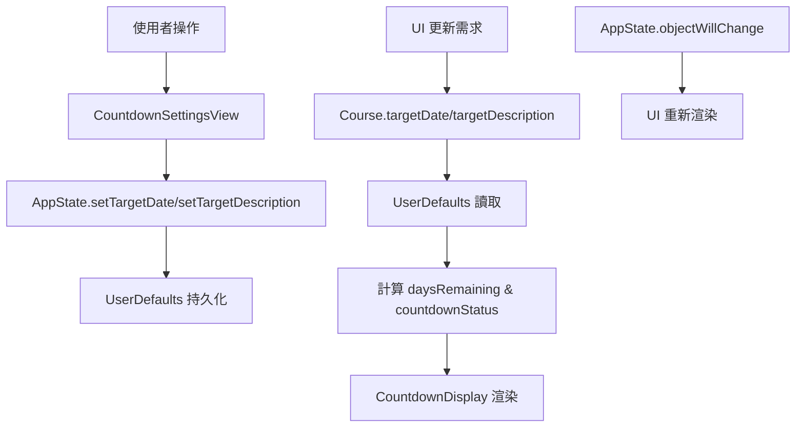

# AceClass 開發者文檔

一個專為 macOS 設計的 SwiftUI 補課影片管理應用程式的完整技術文檔。

## 📋 目錄

1. [專案概覽](#專案概覽)
2. [核心架構與設計](#核心架構與設計)
3. [資料模型與持久化](#資料模型與持久化)
4. [倒數計日功能架構](#倒數計日功能架構)
5. [macOS 沙盒權限管理](#macos-沙盒權限管理)
6. [影片播放架構](#影片播放架構)
7. [錯誤處理與調試](#錯誤處理與調試)
8. [效能最佳化](#效能最佳化)
9. [建置與部署](#建置與部署)
10. [架構決策記錄](#架構決策記錄)
11. [測試策略](#測試策略)

## 1. 專案概覽

### 1.1 應用程式簡介

AceClass 是一個為 macOS 設計的 SwiftUI 應用程式，旨在幫助使用者管理和觀看本地儲存的補課影片。使用者可以選擇一個包含多個課程資料夾的根目錄，應用程式會自動掃描課程和影片，並提供一個方便的介面來播放、追蹤觀看狀態和做筆記。

### 1.2 專案演進

此專案最初由 Xcode 的文件導向（Document-Based）應用程式模板建立，但後續已重構為一個標準的單視窗應用程式，以更符合其直接操作檔案系統的功能需求。

### 1.3 技術堆疊

- **Framework**: SwiftUI + Combine
- **Language**: Swift 5.7+
- **Platform**: macOS 15.4+
- **Architecture**: MVVM + ObservableObject
- **Storage**: UserDefaults + JSON Files
- **Security**: App Sandbox + Security-Scoped Bookmarks

## 2. 核心架構與設計

### 2.1 架構模式

本專案採用了類似 MVVM (Model-View-ViewModel) 的架構，利用 SwiftUI 的特性實現：

#### Model Layer

由 `Models.swift` 中的結構體定義：

- `Course` - 課程資料模型
- `VideoItem` - 影片項目資料模型
- `CountdownStatus` - 倒數計日狀態枚舉

#### View Layer

所有的 UI 視圖檔案：

- `ContentView.swift` - 主視圖容器，採用 `NavigationSplitView` 實現三欄布局
- `CourseRowView.swift` - 側邊欄課程列表項
- `VideoRowView.swift` - 中間影片列表項，包含編輯功能
- `UnwatchedVideoRowView.swift` - 統計視圖中的未觀看影片項
- `CourseStatisticsView.swift` - 課程統計面板
- `VideoPlayerView.swift` - 影片播放器（支援全螢幕）
- `CountdownSettingsView.swift` - 倒數計日設定視圖
- `CountdownOverviewView.swift` - 倒數計日概覽視圖
- `CountdownDisplay.swift` - 倒數計日顯示元件

#### ViewModel/State Management

`AppState.swift` 作為主要的狀態管理器，使用 `ObservableObject` 協議管理應用程式全域狀態。

### 2.2 狀態管理架構

```swift
@MainActor
class AppState: ObservableObject {
    // MARK: - Published Properties
    @Published var courses: [Course] = []
    @Published var selectedCourseID: UUID?
    @Published var currentVideo: VideoItem?
    @Published var currentVideoURL: URL?
    @Published var isVideoPlayerFullScreen = false
    @Published var sourceFolderURL: URL?
  
    // MARK: - Countdown State
    @Published var showingCountdownSettings = false
    @Published var showingCountdownOverview = false
  
    // MARK: - Private Properties
    private var securityScopedURL: URL?
    private var currentlyAccessedVideoURL: URL?
  
    // MARK: - Countdown Data Access
    func getTargetDate(for courseID: UUID) -> Date? {
        UserDefaults.standard.object(forKey: "targetDate_\(courseID)") as? Date
    }
  
    func setTargetDate(_ date: Date?, for courseID: UUID) {
        if let date = date {
            UserDefaults.standard.set(date, forKey: "targetDate_\(courseID)")
        } else {
            UserDefaults.standard.removeObject(forKey: "targetDate_\(courseID)")
        }
        // Trigger UI updates
        objectWillChange.send()
    }
  
    func getTargetDescription(for courseID: UUID) -> String {
        UserDefaults.standard.string(forKey: "targetDescription_\(courseID)") ?? ""
    }
  
    func setTargetDescription(_ description: String, for courseID: UUID) {
        UserDefaults.standard.set(description, forKey: "targetDescription_\(courseID)")
    }
}
```

### 2.3 並發和線程安全

#### 主線程管理

```swift
// 所有 UI 更新使用 @MainActor 確保在主線程執行
@MainActor
func updateCourses(_ newCourses: [Course]) {
    self.courses = newCourses
}
```

#### 後台線程處理

```swift
// 檔案 I/O 操作在後台線程執行
Task.detached {
    let courses = await self.loadCoursesFromDisk()
    await MainActor.run {
        self.courses = courses
    }
}
```

#### 狀態更新策略

- 避免在視圖更新期間修改狀態
- 使用 `Task.detached` 處理副作用
- 確保所有 `@Published` 屬性的更新都在主線程

## 3. 資料模型與持久化

### 3.1 核心資料結構

#### VideoItem 模型

```swift
struct VideoItem: Identifiable, Codable {
    let id: UUID
    let fileName: String         // 實際檔名
    var displayName: String      // 顯示名稱
    var note: String             // 註解
    var watched: Bool            // 是否已看
    let date: Date?              // 從檔名解析出的日期
  
    init(fileName: String, folderURL: URL) {
        self.id = UUID()
        self.fileName = fileName
        self.displayName = fileName.replacingOccurrences(of: ".mp4", with: "")
        self.note = ""
        self.watched = false
        self.date = Self.extractDate(from: fileName)
    }
  
    static func extractDate(from fileName: String) -> Date? {
        // 日期解析邏輯
        let pattern = "(?:20)?(\\d{2})(\\d{2})(\\d{2})"
        // 支援 20250704 和 250704 格式
        // 自動補充 "20" 前綴處理兩位數年份
    }
}
```

#### Course 模型

```swift
struct Course: Identifiable, Hashable {
    let id = UUID()
    let folderURL: URL
    var videos: [VideoItem]
  
    // MARK: - Countdown Properties (Computed)
    var targetDate: Date? {
        get {
            UserDefaults.standard.object(forKey: "targetDate_\(id)") as? Date
        }
        set {
            if let date = newValue {
                UserDefaults.standard.set(date, forKey: "targetDate_\(id)")
            } else {
                UserDefaults.standard.removeObject(forKey: "targetDate_\(id)")
            }
        }
    }
  
    var targetDescription: String {
        get {
            UserDefaults.standard.string(forKey: "targetDescription_\(id)") ?? ""
        }
        set {
            UserDefaults.standard.set(newValue, forKey: "targetDescription_\(id)")
        }
    }
  
    // MARK: - Computed Properties
    var daysRemaining: Int? {
        guard let targetDate = targetDate else { return nil }
        return Calendar.current.dateComponents([.day], from: Date(), to: targetDate).day
    }
  
    var countdownStatus: CountdownStatus {
        guard let days = daysRemaining else { return .none }
        if days < 0 { return .overdue }
        if days <= 3 { return .soon }
        return .normal
    }
  
    var watchedCount: Int {
        videos.filter { $0.watched }.count
    }
  
    var totalVideoCount: Int {
        videos.count
    }
  
    var countdownText: String {
        guard let days = daysRemaining else { return "" }
        switch countdownStatus {
        case .overdue:
            return "已過期 \(abs(days)) 天"
        case .soon:
            return "剩餘 \(days) 天"
        case .normal:
            return "剩餘 \(days) 天"
        case .none:
            return ""
        }
    }
}

enum CountdownStatus {
    case none, normal, soon, overdue
}
```

### 3.2 混合儲存策略

應用程式採用本地優先的混合儲存策略：

#### 本地儲存 (主要)

```swift
class LocalMetadataStorage {
    static let baseDirectory: URL = {
        let appSupport = FileManager.default.urls(for: .applicationSupportDirectory, 
                                                in: .userDomainMask).first!
        return appSupport.appendingPathComponent("AceClass")
    }()
  
    static let coursesDirectory: URL = {
        return baseDirectory.appendingPathComponent("Courses")
    }()
  
    static func localVideoMetadataURL(for courseID: UUID) -> URL {
        return coursesDirectory.appendingPathComponent("\(courseID)_videos.json")
    }
}
```

#### 外部同步 (輔助)

```swift
extension LocalMetadataStorage {
    static var shouldAttemptWriteToExternalDrives: Bool = true
  
    static func externalVideoMetadataURL(for course: Course) -> URL {
        return course.folderURL.appendingPathComponent("videos.json")
    }
  
    static func saveToExternal(_ videos: [VideoItem], for course: Course) {
        guard shouldAttemptWriteToExternalDrives else { return }
    
        do {
            let data = try JSONEncoder().encode(videos)
            try data.write(to: externalVideoMetadataURL(for: course))
        } catch {
            // Fail silently - external sync is best effort
            print("External sync failed: \(error)")
        }
    }
}
```

#### 倒數計日資料儲存

倒數計日功能採用 macOS UserDefaults 進行本地儲存：

```swift
// 存儲格式
UserDefaults.standard.set(targetDate, forKey: "targetDate_\(courseID)")
UserDefaults.standard.set(description, forKey: "targetDescription_\(courseID)")

// 存儲位置
// ~/Library/Containers/ChenChiJiun.AceClass/Data/Library/Preferences/ChenChiJiun.AceClass.plist
```

**設計考量：**

- **隱私性**: 倒數計日資料僅存本地，避免透露個人學習計劃
- **可靠性**: UserDefaults 提供穩定的系統級儲存
- **效能**: 快速讀取，適合頻繁的 UI 更新需求
- **隔離性**: 每台設備的學習目標可能不同，因此不同步

### 3.3 日期解析算法

```swift
extension VideoItem {
    static func extractDate(from fileName: String) -> Date? {
        // 正則表達式匹配日期格式
        let pattern = "(?:20)?(\\d{2})(\\d{2})(\\d{2})"
    
        guard let regex = try? NSRegularExpression(pattern: pattern, options: []),
              let match = regex.firstMatch(in: fileName, range: NSRange(fileName.startIndex..., in: fileName)) else {
            return nil
        }
    
        let yearRange = Range(match.range(at: 1), in: fileName)!
        let monthRange = Range(match.range(at: 2), in: fileName)!
        let dayRange = Range(match.range(at: 3), in: fileName)!
    
        let yearString = String(fileName[yearRange])
        let monthString = String(fileName[monthRange])
        let dayString = String(fileName[dayRange])
    
        // 自動補充 "20" 前綴處理兩位數年份
        let fullYear = yearString.count == 2 ? "20\(yearString)" : yearString
    
        guard let year = Int(fullYear),
              let month = Int(monthString),
              let day = Int(dayString) else {
            return nil
        }
    
        var components = DateComponents()
        components.year = year
        components.month = month
        components.day = day
    
        return Calendar.current.date(from: components)
    }
}
```

---

## 4. 倒數計日功能架構

### 4.1 功能概覽

倒數計日功能讓使用者為每個課程設定目標完成日期，並即時追蹤剩餘天數。系統提供視覺化的狀態指示和統一的概覽界面。

### 4.2 UI 元件架構

#### CountdownDisplay.swift - 核心顯示元件

```swift
struct CountdownDisplay: View {
    let course: Course
  
    var body: some View {
        if let daysRemaining = course.daysRemaining {
            HStack(spacing: 8) {
                Image(systemName: iconName)
                    .foregroundColor(statusColor)
            
                VStack(alignment: .leading, spacing: 2) {
                    Text(course.countdownText)
                        .font(.caption)
                        .foregroundColor(statusColor)
                
                    if !course.targetDescription.isEmpty {
                        Text(course.targetDescription)
                            .font(.caption2)
                            .foregroundColor(.secondary)
                    }
                }
            
                Spacer()
            }
            .padding(.vertical, 4)
            .padding(.horizontal, 8)
            .background(statusColor.opacity(0.1))
            .cornerRadius(6)
        }
    }
  
    private var statusColor: Color {
        switch course.countdownStatus {
        case .overdue: return .red
        case .soon: return .orange
        case .normal: return .blue
        case .none: return .clear
        }
    }
  
    private var iconName: String {
        switch course.countdownStatus {
        case .overdue: return "exclamationmark.triangle.fill"
        case .soon: return "clock.fill"
        case .normal: return "calendar"
        case .none: return ""
        }
    }
}
```

#### CountdownSettingsView.swift - 設定界面

```swift
struct CountdownSettingsView: View {
    @ObservedObject var appState: AppState
    let courseID: UUID
  
    @State private var hasTargetDate: Bool = false
    @State private var selectedDate: Date = Date()
    @State private var targetDescription: String = ""
    @State private var isLoading: Bool = false
  
    var body: some View {
        NavigationView {
            ScrollView {
                VStack(spacing: 20) {
                    // 主要設定區域
                    VStack(spacing: 16) {
                        toggleSection
                    
                        if hasTargetDate {
                            dateSettingsSection
                            quickSetSection
                            countdownStatusSection
                            saveButtonSection
                        }
                    }
                    .padding()
                    .background(Color(.controlBackgroundColor))
                    .cornerRadius(12)
                
                    // 課程狀態概覽
                    if !appState.upcomingDeadlines.isEmpty || !appState.overdueCoures.isEmpty {
                        courseStatusSection
                            .padding()
                            .background(Color(.controlBackgroundColor))
                            .cornerRadius(12)
                    }
                }
                .padding()
            }
            .navigationTitle("倒數計日")
            .frame(minWidth: 500, minHeight: 400)
            .toolbar {
                ToolbarItem(placement: .confirmationAction) {
                    Button("完成") {
                        Task {
                            await saveSettings()
                        }
                    }
                    .disabled(isLoading)
                }
            }
            .onAppear {
                loadCurrentSettings()
            }
        }
        .frame(minWidth: 600, minHeight: 500)
    }
  
    @MainActor
    private func saveSettings() async {
        isLoading = true
        defer { isLoading = false }
    
        await appState.setTargetDate(
            for: courseID,
            targetDate: hasTargetDate ? selectedDate : nil,
            description: targetDescription
        )
    }
}
```

#### CountdownOverviewView.swift - 概覽界面

```swift
struct CountdownOverviewView: View {
    @ObservedObject var appState: AppState
  
    var body: some View {
        NavigationView {
            ScrollView {
                VStack(alignment: .leading, spacing: 20) {
                    // 即將到期課程
                    if !upcomingDeadlines.isEmpty {
                        sectionView(
                            title: "即將到期課程",
                            icon: "clock",
                            color: .orange,
                            courses: upcomingDeadlines
                        )
                    }
                
                    // 已過期課程
                    if !overdueCourses.isEmpty {
                        sectionView(
                            title: "已過期課程",
                            icon: "exclamationmark.triangle.fill",
                            color: .red,
                            courses: overdueCourses
                        )
                    }
                
                    // 所有目標課程
                    if !allTargetCourses.isEmpty {
                        sectionView(
                            title: "所有目標課程",
                            icon: "calendar",
                            color: .blue,
                            courses: allTargetCourses
                        )
                    }
                
                    if upcomingDeadlines.isEmpty && overdueCourses.isEmpty && allTargetCourses.isEmpty {
                        emptyStateView
                    }
                }
                .padding()
            }
            .navigationTitle("倒數計日概覽")
            .frame(minWidth: 600, minHeight: 400)
        }
    }
  
    // 計算屬性用於過濾課程
    private var upcomingDeadlines: [Course] {
        appState.courses.filter { course in
            guard let days = course.daysRemaining else { return false }
            return days >= 0 && days <= 7
        }
    }
  
    private var overdueCourses: [Course] {
        appState.courses.filter { course in
            guard let days = course.daysRemaining else { return false }
            return days < 0
        }
    }
  
    private var allTargetCourses: [Course] {
        appState.courses.filter { $0.targetDate != nil }
    }
}
```

### 4.3 資料流架構



### 4.4 狀態計算邏輯

```swift
enum CountdownStatus {
    case none       // 未設定目標日期
    case normal     // 正常倒數（> 3天）
    case soon       // 即將到期（≤ 3天且 ≥ 0天）
    case overdue    // 已過期（< 0天）
}

extension Course {
    var daysRemaining: Int? {
        guard let targetDate = targetDate else { return nil }
        let calendar = Calendar.current
        let startOfToday = calendar.startOfDay(for: Date())
        let startOfTargetDate = calendar.startOfDay(for: targetDate)
    
        return calendar.dateComponents([.day], from: startOfToday, to: startOfTargetDate).day
    }
  
    var countdownStatus: CountdownStatus {
        guard let days = daysRemaining else { return .none }
        if days < 0 { return .overdue }
        if days <= 3 { return .soon }
        return .normal
    }
}
```

### 4.5 快速設定實現

```swift
struct QuickSetButton: View {
    let title: String
    let days: Int
    let action: () -> Void
  
    var body: some View {
        Button(action: action) {
            VStack(spacing: 4) {
                Text(title)
                    .font(.subheadline)
                    .fontWeight(.medium)
                Text("\(days)天")
                    .font(.caption)
                    .foregroundColor(.secondary)
            }
            .frame(maxWidth: .infinity)
            .padding(.vertical, 12)
            .background(Color(.controlBackgroundColor))
            .cornerRadius(8)
            .overlay(
                RoundedRectangle(cornerRadius: 8)
                    .stroke(Color(.separatorColor), lineWidth: 0.5)
            )
        }
        .buttonStyle(.plain)
    }
}

// 使用方式
LazyVGrid(columns: Array(repeating: GridItem(.flexible(), spacing: 12), count: 3), spacing: 12) {
    ForEach(quickSetOptions, id: \.0) { title, days in
        QuickSetButton(title: title, days: days) {
            selectedDate = Calendar.current.date(byAdding: .day, value: days, to: Date()) ?? Date()
        }
    }
}

private let quickSetOptions = [
    ("1週", 7), ("2週", 14), ("1個月", 30),
    ("2個月", 60), ("3個月", 90), ("6個月", 180)
]
```

### 4.6 macOS 適配最佳化

#### 視窗尺寸管理

```swift
// 設定最小視窗尺寸確保內容正常顯示
.frame(minWidth: 600, minHeight: 400)

// Sheet 尺寸調整
.sheet(isPresented: $showingCountdownSettings) {
    CountdownSettingsView(appState: appState, courseID: selectedCourseID)
        .frame(minWidth: 500, minHeight: 350)
}
```

#### 顏色相容性

```swift
// 使用 macOS 相容的顏色，避免 iOS 專用顏色
extension Color {
    static var countdownNormal: Color { .blue }
    static var countdownSoon: Color { .orange }
    static var countdownOverdue: Color { .red }
}
```

#### 工具欄整合

```swift
.toolbar {
    ToolbarItem(placement: .primaryAction) {
        Menu {
            Button("設定目標日期", systemImage: "gear") {
                showingCountdownSettings = true
            }
            Button("倒數計日概覽", systemImage: "calendar") {
                showingCountdownOverview = true
            }
        } label: {
            Image(systemName: "ellipsis.circle")
        }
    }
}
```

---

## 5. macOS 沙盒權限管理

### 5.1 Entitlements 配置

```xml
<!-- AceClass.entitlements -->
<?xml version="1.0" encoding="UTF-8"?>
<!DOCTYPE plist PUBLIC "-//Apple//DTD PLIST 1.0//EN" "http://www.apple.com/DTDs/PropertyList-1.0.dtd">
<plist version="1.0">
<dict>
    <!-- 啟用 App Sandbox -->
    <key>com.apple.security.app-sandbox</key>
    <true/>
  
    <!-- 允許讀寫使用者選擇的檔案 -->
    <key>com.apple.security.files.user-selected.read-write</key>
    <true/>
  
    <!-- 允許建立和使用安全作用域書籤 -->
    <key>com.apple.security.files.bookmarks.app-scope</key>
    <true/>
    <key>com.apple.security.files.bookmarks.document-scope</key>
    <true/>
  
    <!-- 允許網路存取（如需要） -->
    <key>com.apple.security.network.client</key>
    <false/>
</dict>
</plist>
```

### 5.2 安全作用域書籤流程

```swift
extension AppState {
    private let bookmarkKey = "SourceFolderBookmark"
  
    // 1. 使用者選擇資料夾
    func handleFolderSelection(_ result: Result<[URL], Error>) {
        switch result {
        case .success(let urls):
            guard let folder = urls.first else { return }
        
            // 2. 啟動安全作用域存取
            guard folder.startAccessingSecurityScopedResource() else {
                print("Failed to access security scoped resource")
                return
            }
        
            // 3. 建立持久化書籤
            do {
                let bookmarkData = try folder.bookmarkData(
                    options: .withSecurityScope,
                    includingResourceValuesForKeys: nil,
                    relativeTo: nil
                )
                UserDefaults.standard.set(bookmarkData, forKey: bookmarkKey)
            
                // 4. 保持權限直到應用關閉
                self.securityScopedURL?.stopAccessingSecurityScopedResource()
                self.securityScopedURL = folder
                self.sourceFolderURL = folder
            
                // 5. 載入課程
                Task {
                    await loadCourses()
                }
            
            } catch {
                print("Failed to create bookmark: \(error)")
                folder.stopAccessingSecurityScopedResource()
            }
        
        case .failure(let error):
            print("Folder selection failed: \(error)")
        }
    }
  
    // 6. 應用啟動時恢復權限
    func loadBookmark() {
        guard let bookmarkData = UserDefaults.standard.data(forKey: bookmarkKey) else { return }
    
        do {
            var isStale = false
            let url = try URL(
                resolvingBookmarkData: bookmarkData,
                options: .withSecurityScope,
                relativeTo: nil,
                bookmarkDataIsStale: &isStale
            )
        
            if isStale {
                print("Bookmark is stale, user needs to reselect folder")
                return
            }
        
            guard url.startAccessingSecurityScopedResource() else {
                print("Failed to access security scoped resource from bookmark")
                return
            }
        
            self.securityScopedURL = url
            self.sourceFolderURL = url
        
            Task {
                await loadCourses()
            }
        
        } catch {
            print("Failed to resolve bookmark: \(error)")
        }
    }
  
    // 7. 清理資源
    deinit {
        securityScopedURL?.stopAccessingSecurityScopedResource()
        currentlyAccessedVideoURL?.stopAccessingSecurityScopedResource()
    }
}
```

### 5.3 權限繼承策略

- **根權限**: 對選擇的根資料夾持有一個安全作用域權限
- **子資料夾繼承**: 所有子資料夾和檔案操作自動繼承根權限
- **避免重複請求**: 不在每個檔案操作時重複呼叫 `startAccessingSecurityScopedResource()`

```swift
// 正確的檔案存取方式
func accessVideoFile(_ videoURL: URL) {
    // 不需要再次請求權限，直接使用
    let player = AVPlayer(url: videoURL)
    // ...
}

// 錯誤的方式（會導致權限問題）
func accessVideoFileWrong(_ videoURL: URL) {
    guard videoURL.startAccessingSecurityScopedResource() else { return }
    // 這是不必要的，因為根權限已經涵蓋了子檔案
}
```

---

## 6. 影片播放架構

### 6.1 AVPlayer 整合

```swift
import AVKit

struct VideoPlayerView: View {
    let videoURL: URL
    @ObservedObject var appState: AppState
  
    var body: some View {
        ZStack {
            if let url = appState.currentVideoURL {
                VideoPlayer(player: AVPlayer(url: url))
                    .onAppear {
                        // 標記為已觀看
                        markVideoAsWatched()
                    }
            } else {
                ContentUnavailableView(
                    "選擇影片",
                    systemImage: "play.circle",
                    description: Text("從左側列表選擇要播放的影片")
                )
            }
        
            // 全螢幕覆蓋
            if appState.isVideoPlayerFullScreen {
                FullScreenVideoPlayerView(
                    player: AVPlayer(url: appState.currentVideoURL!),
                    onToggleFullScreen: appState.toggleFullScreen
                )
                .background(Color.black)
                .edgesIgnoringSafeArea(.all)
            }
        }
        .onReceive(NotificationCenter.default.publisher(for: .init("ToggleFullScreen"))) { _ in
            appState.toggleFullScreen()
        }
    }
  
    private func markVideoAsWatched() {
        guard let currentVideo = appState.currentVideo,
              let courseID = appState.selectedCourseID else { return }
    
        Task {
            await appState.markVideoAsWatched(currentVideo.id, in: courseID)
        }
    }
}
```

### 6.2 全螢幕模式

```swift
struct FullScreenVideoPlayerView: View {
    let player: AVPlayer
    let onToggleFullScreen: () -> Void
    @State private var showControls = true
  
    var body: some View {
        ZStack {
            VideoPlayer(player: player)
                .onTapGesture {
                    withAnimation {
                        showControls.toggle()
                    }
                }
        
            if showControls {
                VStack {
                    HStack {
                        Button("退出全螢幕") {
                            onToggleFullScreen()
                        }
                        .buttonStyle(.bordered)
                    
                        Spacer()
                    }
                    .padding()
                
                    Spacer()
                }
            }
        }
        .onAppear {
            player.play()
        }
        .onDisappear {
            player.pause()
        }
    }
}

// 快捷鍵支援
extension AppState {
    func setupKeyboardShortcuts() {
        // Cmd+Ctrl+F 切換全螢幕
        NSEvent.addLocalMonitorForEvents(matching: .keyDown) { event in
            if event.modifierFlags.contains([.command, .control]) && event.keyCode == 3 { // F key
                toggleFullScreen()
                return nil
            }
            return event
        }
    }
  
    func toggleFullScreen() {
        withAnimation(.easeInOut(duration: 0.3)) {
            isVideoPlayerFullScreen.toggle()
        }
    }
}
```

---

## 7. 錯誤處理與調試

### 7.1 權限調試工具

```swift
#if DEBUG
extension AppState {
    func debugPermissionStatus() {
        print("=== 權限狀態調試 ===")
    
        // 檢查安全作用域權限
        if let securityScopedURL = securityScopedURL {
            print("Security scoped URL: \(securityScopedURL.path)")
            print("Can read: \(FileManager.default.isReadableFile(atPath: securityScopedURL.path))")
            print("Can write: \(FileManager.default.isWritableFile(atPath: securityScopedURL.path))")
        } else {
            print("No security scoped URL available")
        }
    
        // 檢查書籤狀態
        if let bookmarkData = UserDefaults.standard.data(forKey: "SourceFolderBookmark") {
            print("Bookmark data size: \(bookmarkData.count) bytes")
        
            do {
                var isStale = false
                let url = try URL(resolvingBookmarkData: bookmarkData, options: .withSecurityScope, relativeTo: nil, bookmarkDataIsStale: &isStale)
                print("Bookmark URL: \(url.path)")
                print("Bookmark is stale: \(isStale)")
            } catch {
                print("Bookmark resolution failed: \(error)")
            }
        } else {
            print("No bookmark data found")
        }
    
        // 檢查應用容器
        let containerURL = FileManager.default.urls(for: .applicationSupportDirectory, in: .userDomainMask).first!
        print("App container: \(containerURL.path)")
        print("Container exists: \(FileManager.default.fileExists(atPath: containerURL.path))")
    }
}
#endif
```

### 7.2 常見問題解決

#### 1. "Publishing changes from within view updates" 警告

```swift
// 錯誤做法
struct CourseRowView: View {
    @ObservedObject var appState: AppState
  
    var body: some View {
        Text("Course")
            .onAppear {
                // 這會觸發警告
                appState.selectedCourseID = course.id
            }
    }
}

// 正確做法
struct CourseRowView: View {
    @ObservedObject var appState: AppState
  
    var body: some View {
        Text("Course")
            .onAppear {
                Task { @MainActor in
                    appState.selectedCourseID = course.id
                }
            }
    }
}
```

#### 2. 權限問題診斷

```swift
extension AppState {
    func validateFileAccess(_ url: URL) -> Bool {
        // 檢查檔案是否存在
        guard FileManager.default.fileExists(atPath: url.path) else {
            print("File does not exist: \(url.path)")
            return false
        }
    
        // 檢查讀取權限
        guard FileManager.default.isReadableFile(atPath: url.path) else {
            print("File is not readable: \(url.path)")
            return false
        }
    
        return true
    }
}
```

#### 3. 倒數計日相關錯誤處理

```swift
extension Course {
    var daysRemaining: Int? {
        guard let targetDate = targetDate else { return nil }
    
        // 處理無效日期
        guard targetDate.timeIntervalSince1970 > 0 else {
            print("Invalid target date: \(targetDate)")
            return nil
        }
    
        let calendar = Calendar.current
        let startOfToday = calendar.startOfDay(for: Date())
        let startOfTargetDate = calendar.startOfDay(for: targetDate)
    
        guard let components = calendar.dateComponents([.day], from: startOfToday, to: startOfTargetDate).day else {
            print("Failed to calculate date components")
            return nil
        }
    
        return components
    }
}
```

---

## 8. 效能最佳化

### 8.1 課程載入最佳化

```swift
extension AppState {
    @MainActor
    func loadCourses() async {
        guard let sourceFolderURL = sourceFolderURL else { return }
    
        // 在背景線程進行檔案掃描
        let newCourses = await withTaskGroup(of: Course?.self) { group in
            var courses: [Course] = []
        
            // 並行掃描子資料夾
            let subfolders = getSubfolders(in: sourceFolderURL)
            for folderURL in subfolders {
                group.addTask {
                    return await self.loadCourse(from: folderURL)
                }
            }
        
            for await course in group {
                if let course = course {
                    courses.append(course)
                }
            }
        
            return courses.sorted { $0.folderURL.lastPathComponent < $1.folderURL.lastPathComponent }
        }
    
        // 在主線程更新 UI
        self.courses = newCourses
    }
  
    private func loadCourse(from folderURL: URL) async -> Course? {
        do {
            let videoFiles = try FileManager.default.contentsOfDirectory(at: folderURL, includingPropertiesForKeys: nil)
                .filter { $0.pathExtension.lowercased() == "mp4" }
        
            let videos = videoFiles.map { VideoItem(fileName: $0.lastPathComponent, folderURL: folderURL) }
                .sorted { ($0.date ?? Date.distantPast) < ($1.date ?? Date.distantPast) }
        
            var course = Course(folderURL: folderURL, videos: videos)
        
            // 載入本地或外部的影片元數據
            await loadVideoMetadata(for: &course)
        
            return course
        } catch {
            print("Failed to load course from \(folderURL): \(error)")
            return nil
        }
    }
}
```

### 8.2 倒數計日計算最佳化

```swift
// 使用快取避免重複計算
class CountdownCache {
    private var cache: [UUID: (date: Date, result: Int?)] = [:]
    private let cacheQueue = DispatchQueue(label: "countdown.cache", attributes: .concurrent)
  
    func getDaysRemaining(for courseID: UUID, targetDate: Date) -> Int? {
        return cacheQueue.sync {
            // 檢查快取是否有效（同一天）
            if let cached = cache[courseID],
               Calendar.current.isDate(cached.date, inSameDayAs: Date()) {
                return cached.result
            }
        
            // 計算新值
            let days = Calendar.current.dateComponents([.day], from: Date(), to: targetDate).day
        
            // 更新快取
            cacheQueue.async(flags: .barrier) {
                self.cache[courseID] = (Date(), days)
            }
        
            return days
        }
    }
}
```

### 8.3 記憶體管理

```swift
// 正確的 AVPlayer 管理
class VideoPlayerManager: ObservableObject {
    private var player: AVPlayer?
  
    func playVideo(at url: URL) {
        // 清理舊的播放器
        player?.pause()
        player = nil
    
        // 創建新播放器
        player = AVPlayer(url: url)
        player?.play()
    }
  
    func pause() {
        player?.pause()
    }
  
    deinit {
        player?.pause()
        player = nil
    }
}

// 避免循環引用
class AppState: ObservableObject {
    private weak var delegate: AppStateDelegate?
  
    func setDelegate(_ delegate: AppStateDelegate) {
        self.delegate = delegate
    }
}
```

---

## 9. 建置與部署

### 9.1 開發環境需求

```swift
// Package.swift (如使用 SPM)
// swift-tools-version: 5.7

import PackageDescription

let package = Package(
    name: "AceClass",
    platforms: [
        .macOS(.v13)
    ],
    products: [
        .executable(name: "AceClass", targets: ["AceClass"])
    ],
    dependencies: [
        // 外部依賴（如有）
    ],
    targets: [
        .executableTarget(
            name: "AceClass",
            dependencies: []
        )
    ]
)
```

### 9.2 關鍵建置設定

#### Xcode Project Settings

```
// Build Settings
MACOSX_DEPLOYMENT_TARGET = 13.0
SWIFT_VERSION = 5.7
ENABLE_HARDENED_RUNTIME = YES
CODE_SIGN_ENTITLEMENTS = AceClass/AceClass.entitlements

// Info.plist
CFBundleVersion = 1.1.0
CFBundleShortVersionString = 1.1
NSHumanReadableCopyright = © 2025 AceClass Team
LSMinimumSystemVersion = 13.0
```

#### 程式碼簽署設定

```bash
# 開發用簽署
codesign --force --sign "Developer ID Application: Your Name" --entitlements AceClass.entitlements AceClass.app

# 驗證簽署
codesign --verify --verbose AceClass.app
spctl --assess --verbose AceClass.app
```

### 9.3 自動化建置

```bash
#!/bin/bash
# build_release.sh

set -e

echo "Building AceClass for release..."

# 清理舊的建置
rm -rf build/
mkdir -p build/

# 使用 xcodebuild 建置
xcodebuild \
    -project AceClass.xcodeproj \
    -scheme AceClass \
    -configuration Release \
    -derivedDataPath build/DerivedData \
    -archivePath build/AceClass.xcarchive \
    archive

# 匯出應用程式
xcodebuild \
    -exportArchive \
    -archivePath build/AceClass.xcarchive \
    -exportPath build/ \
    -exportOptionsPlist ExportOptions.plist

echo "Build completed successfully!"
echo "App location: build/AceClass.app"
```

### 9.4 測試策略

#### 單元測試

```swift
import XCTest
@testable import AceClass

class CourseTests: XCTestCase {
    func testCountdownCalculation() {
        let course = Course(folderURL: URL(string: "file:///test")!, videos: [])
    
        // 測試未來日期
        let futureDate = Calendar.current.date(byAdding: .day, value: 5, to: Date())!
        course.targetDate = futureDate
    
        XCTAssertEqual(course.daysRemaining, 5)
        XCTAssertEqual(course.countdownStatus, .normal)
    
        // 測試過期日期
        let pastDate = Calendar.current.date(byAdding: .day, value: -2, to: Date())!
        course.targetDate = pastDate
    
        XCTAssertEqual(course.daysRemaining, -2)
        XCTAssertEqual(course.countdownStatus, .overdue)
    }
  
    func testVideoDateExtraction() {
        let testCases = [
            ("20250704_test.mp4", "2025-07-04"),
            ("250704_test.mp4", "2025-07-04"),
            ("invalid.mp4", nil)
        ]
    
        for (fileName, expectedDateString) in testCases {
            let extractedDate = VideoItem.extractDate(from: fileName)
        
            if let expectedDateString = expectedDateString {
                let formatter = DateFormatter()
                formatter.dateFormat = "yyyy-MM-dd"
                let expectedDate = formatter.date(from: expectedDateString)
                XCTAssertEqual(extractedDate, expectedDate)
            } else {
                XCTAssertNil(extractedDate)
            }
        }
    }
}
```

#### UI 測試

```swift
import XCTest

class AceClassUITests: XCTestCase {
    var app: XCUIApplication!
  
    override func setUpWithError() throws {
        app = XCUIApplication()
        app.launch()
    }
  
    func testCountdownSettings() throws {
        // 點擊設定按鈕
        app.buttons["設定"].click()
    
        // 啟用倒數計日
        app.checkBoxes["設定目標日期"].click()
    
        // 選擇日期
        app.datePickers.firstMatch.click()
    
        // 輸入描述
        app.textFields["目標描述"].typeText("期末考試")
    
        // 保存設定
        app.buttons["完成"].click()
    
        // 驗證設定已保存
        XCTAssertTrue(app.staticTexts.containing(NSPredicate(format: "label CONTAINS '剩餘'")).firstMatch.exists)
    }
}
```

#### 效能測試

```swift
class PerformanceTests: XCTestCase {
    func testCourseLoadingPerformance() {
        measure {
            // 測試載入大量課程的效能
            let appState = AppState()
            let expectation = XCTestExpectation(description: "Courses loaded")
        
            Task {
                await appState.loadCourses()
                expectation.fulfill()
            }
        
            wait(for: [expectation], timeout: 5.0)
        }
    }
  
    func testCountdownCalculationPerformance() {
        let courses = (0..<1000).map { _ in
            Course(folderURL: URL(string: "file:///test")!, videos: [])
        }
    
        measure {
            for course in courses {
                course.targetDate = Date()
                _ = course.daysRemaining
                _ = course.countdownStatus
            }
        }
    }
}
```

---

## 10. 架構決策記錄

### 10.1 為什麼選擇混合儲存策略？

**決策**: 觀看記錄使用本地+外部同步，倒數計日僅使用本地儲存

**原因**:

- **可靠性**: 本地儲存確保資料不會遺失
- **可移植性**: 外部同步支援跨裝置使用觀看記錄
- **隱私性**: 倒數計日是個人學習計劃，不應同步
- **彈性**: 即使外部寫入失敗也不影響應用功能

**代碼實現**:

```swift
// 觀看記錄：雙重保存
func saveVideoMetadata(_ videos: [VideoItem], for course: Course) {
    // 1. 本地保存（主要）
    LocalMetadataStorage.saveLocally(videos, for: course)
  
    // 2. 外部同步（輔助）
    LocalMetadataStorage.saveToExternal(videos, for: course)
}

// 倒數計日：僅本地
func setTargetDate(_ date: Date?, for courseID: UUID) {
    UserDefaults.standard.set(date, forKey: "targetDate_\(courseID)")
}
```

### 10.2 為什麼使用單一安全作用域權限？

**決策**: 對根資料夾持有一個安全作用域權限，子檔案自動繼承

**原因**:

- **效能**: 避免重複權限請求的開銷
- **穩定性**: 減少權限相關的錯誤
- **簡化**: 權限管理邏輯更清晰
- **用戶體驗**: 只需要一次授權

**代碼實現**:

```swift
class AppState {
    private var securityScopedURL: URL?
  
    func handleFolderSelection(_ folder: URL) {
        // 只在根資料夾啟動權限
        guard folder.startAccessingSecurityScopedResource() else { return }
        self.securityScopedURL = folder
    
        // 所有子檔案操作都自動繼承這個權限
    }
}
```

### 10.3 為什麼重構為非文件導向應用？

**決策**: 從 Document-Based 重構為標準單視窗應用

**原因**:

- **使用模式**: 使用者操作整個資料夾而非單一文件
- **權限模型**: 更適合安全作用域書籤的使用方式
- **UI 設計**: 三欄布局更適合課程/影片的層次結構
- **功能需求**: 需要同時管理多個課程，而非單一文件

### 10.4 倒數計日功能的設計決策

#### 為什麼選擇 UserDefaults 而非 JSON 檔案？

**決策**: 使用 macOS UserDefaults 儲存倒數計日設定

**原因**:

- **隱私考量**: 學習目標是個人隱私，不應同步到外部裝置
- **系統整合**: UserDefaults 提供更好的 macOS 整合
- **效能**: 快速讀寫，適合頻繁的 UI 更新
- **原子性**: 系統保證的原子性操作
- **備份**: 隨系統備份自動處理

**代碼實現**:

```swift
// 簡潔的 API
func setTargetDate(_ date: Date?, for courseID: UUID) {
    if let date = date {
        UserDefaults.standard.set(date, forKey: "targetDate_\(courseID)")
    } else {
        UserDefaults.standard.removeObject(forKey: "targetDate_\(courseID)")
    }
}
```

#### 為什麼採用計算屬性而非儲存屬性？

**決策**: daysRemaining 和 countdownStatus 使用計算屬性

**原因**:

- **即時性**: 確保倒數計日資訊始終是最新的
- **記憶體效率**: 避免重複儲存計算結果
- **單一來源**: UserDefaults 作為唯一的資料來源
- **自動更新**: 不需要手動維護狀態同步

**代碼實現**:

```swift
struct Course {
    var daysRemaining: Int? {
        guard let targetDate = targetDate else { return nil }
        return Calendar.current.dateComponents([.day], from: Date(), to: targetDate).day
    }
  
    var countdownStatus: CountdownStatus {
        guard let days = daysRemaining else { return .none }
        // 實時計算狀態
    }
}
```

#### 為什麼選擇三級狀態分類？

**決策**: normal, soon, overdue 三種狀態

**原因**:

- **視覺清晰**: 三種顏色易於識別和理解
- **實用性**: 涵蓋最重要的時間節點（正常、緊急、過期）
- **可擴展**: 未來可輕易調整閾值或新增狀態
- **認知負荷**: 不會因為過多狀態而增加用戶負擔

## 11. 測試策略

### 11.1 測試金字塔

```
    E2E Tests (少)
    ├── UI Tests
    └── Integration Tests
  
  Unit Tests (多)
  ├── Model Tests
  ├── Logic Tests
  └── Utility Tests
```

### 11.2 關鍵測試區域

#### 1. 倒數計日邏輯測試

```swift
class CountdownLogicTests: XCTestCase {
    func testDaysRemainingCalculation() {
        // 測試不同日期情況
        // 測試時區處理
        // 測試邊界條件
    }
  
    func testCountdownStatusDetermination() {
        // 測試狀態轉換邏輯
        // 測試閾值邊界
    }
}
```

#### 2. 檔案權限測試

```swift
class SecurityTests: XCTestCase {
    func testSecurityScopedBookmarks() {
        // 測試書籤創建和恢復
        // 測試權限繼承
    }
}
```

#### 3. 資料持久化測試

```swift
class PersistenceTests: XCTestCase {
    func testUserDefaultsStorage() {
        // 測試倒數計日設定儲存
    }
  
    func testJSONSerialization() {
        // 測試影片資料序列化
    }
}
```

### 11.3 持續整合

```yaml
# .github/workflows/test.yml
name: Tests

on: [push, pull_request]

jobs:
  test:
    runs-on: macos-latest
  
    steps:
    - uses: actions/checkout@v2
  
    - name: Run Tests
      run: |
        xcodebuild test \
          -project AceClass.xcodeproj \
          -scheme AceClass \
          -destination 'platform=macOS'
  
    - name: Upload Coverage
      uses: codecov/codecov-action@v1
```

---

**最後更新**: 2025年7月7日
**專案版本**: 1.1 (包含倒數計日功能)
**文檔版本**: 2.0

---

> 💡 **提示**：如需使用指南和常見問題解答，請參考 `USER_GUIDE.md`
