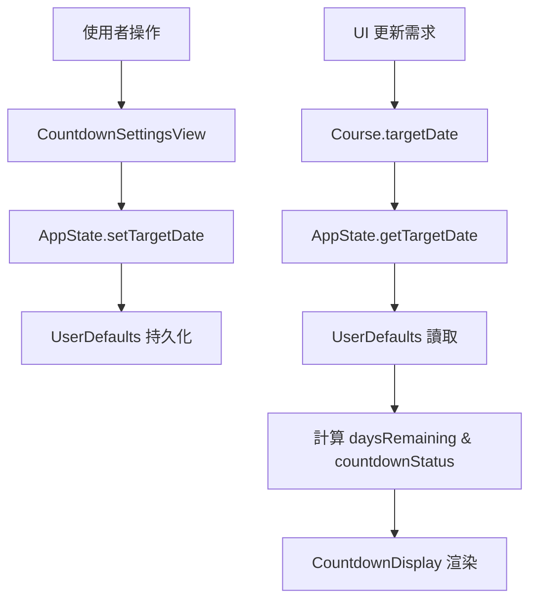

# AceClass 開發文檔

## 1. 專案概覽

AceClass 是一個為 macOS 設計的 SwiftUI 應用程式，旨在幫助使用者管理和觀看本地儲存的補課影片。使用者可以選擇一個包含多個課程資料夾的根目錄，應用程式會自動掃描課程和影片，並提供一個方便的介面來播放、追蹤觀看狀態和做筆記。

此專案最初由 Xcode 的文件導向（Document-Based）應用程式模板建立，但後續已重構為一個標準的單視窗應用程式，以更符合其直接操作檔案系統的功能需求。

---

## 2. 核心架構與設計

### 2.1. 架構模式

本專案採用了類似 MVVM (Model-View-ViewModel) 的架構，利用 SwiftUI 的特性實現：

- **Model**: 由 `Models.swift` 中的 `Course` 和 `VideoItem` 結構體定義。它們是純粹的資料結構，負責表示課程和影片的狀態，並包含編碼/解碼邏輯以進行 JSON 持久化。
- **View**: 所有的 UI 視圖檔案：
  - `ContentView.swift`: 主視圖容器，採用 `NavigationSplitView` 實現三欄布局
  - `CourseRowView.swift`: 側邊欄課程列表項
  - `VideoRowView.swift`: 中間影片列表項，包含編輯功能
  - `UnwatchedVideoRowView.swift`: 統計視圖中的未觀看影片項
  - `CourseStatisticsView.swift`: 課程統計面板
  - `VideoPlayerView.swift`: 影片播放器（支援全螢幕）
  - `CountdownSettingsView.swift`: 倒數計日設定視圖
  - `CountdownOverviewView.swift`: 倒數計日概覽視圖
  - `CountdownDisplay.swift`: 倒數計日顯示元件
- **ViewModel/State Management**: `AppState.swift` 作為主要的狀態管理器，使用 `ObservableObject` 協議管理應用程式全域狀態。

### 2.2. 狀態管理架構

```swift
class AppState: ObservableObject {
    @Published var courses: [Course] = []
    @Published var selectedCourseID: UUID?
    @Published var currentVideo: VideoItem?
    @Published var currentVideoURL: URL?
    @Published var isVideoPlayerFullScreen = false
    @Published var sourceFolderURL: URL?
  
    private var securityScopedURL: URL?
    private var currentlyAccessedVideoURL: URL?
  
    // 倒數計日狀態管理
    @Published var showingCountdownSettings = false
    @Published var showingCountdownOverview = false
  
    // 倒數計日資料存取方法
    func getTargetDate(for courseID: UUID) -> Date? {
        UserDefaults.standard.object(forKey: "targetDate_\(courseID)") as? Date
    }
  
    func setTargetDate(_ date: Date?, for courseID: UUID) {
        if let date = date {
            UserDefaults.standard.set(date, forKey: "targetDate_\(courseID)")
        } else {
            UserDefaults.standard.removeObject(forKey: "targetDate_\(courseID)")
        }
    }
  
    func getTargetDescription(for courseID: UUID) -> String {
        UserDefaults.standard.string(forKey: "targetDescription_\(courseID)") ?? ""
    }
  
    func setTargetDescription(_ description: String, for courseID: UUID) {
        UserDefaults.standard.set(description, forKey: "targetDescription_\(courseID)")
    }
}
```

### 2.3. 並發和線程安全

- **主線程**: 所有 UI 更新使用 `Task { @MainActor in }` 確保在主線程執行
- **後台線程**: 檔案 I/O 操作在 `DispatchQueue.global(qos: .background)` 執行
- **狀態更新**: 避免在視圖更新期間修改狀態，使用 `Task.detached` 處理副作用

---

## 3. 資料模型與持久化

### 3.1. 核心資料結構

```swift
struct VideoItem: Identifiable, Codable {
    let id: UUID
    let fileName: String         // 實際檔名
    var displayName: String      // 顯示名稱
    var note: String             // 註解
    var watched: Bool            // 是否已看
    let date: Date?              // 從檔名解析出的日期
}

struct Course: Identifiable, Hashable {
    let id = UUID()
    let folderURL: URL
    var videos: [VideoItem]
  
    // 倒數計日功能擴展
    var targetDate: Date? {
        get {
            AppState.shared.getTargetDate(for: id)
        }
        set {
            AppState.shared.setTargetDate(newValue, for: id)
        }
    }
  
    var targetDescription: String {
        get {
            AppState.shared.getTargetDescription(for: id)
        }
        set {
            AppState.shared.setTargetDescription(newValue, for: id)
        }
    }
  
    // 計算屬性
    var daysRemaining: Int? {
        guard let targetDate = targetDate else { return nil }
        return Calendar.current.dateComponents([.day], from: Date(), to: targetDate).day
    }
  
    var countdownStatus: CountdownStatus {
        guard let days = daysRemaining else { return .none }
        if days < 0 { return .overdue }
        if days <= 3 { return .soon }
        return .normal
    }
  
    var watchedCount: Int {
        videos.filter { $0.watched }.count
    }
  
    var totalVideoCount: Int {
        videos.count
    }
}

enum CountdownStatus {
    case none, normal, soon, overdue
}
```

### 3.2. 混合儲存策略

應用程式採用本地優先的混合儲存策略：

#### 本地儲存 (主要)

```swift
class LocalMetadataStorage {
    static let baseDirectory: URL = {
        // ~/Library/Containers/App/Data/Library/Application Support/AceClass/
    }()
  
    static let coursesDirectory: URL = {
        // baseDirectory/Courses/
    }()
}
```

#### 外部同步 (輔助)

- 嘗試在每個課程資料夾建立 `videos.json`
- 使用 "best effort" 原則，失敗不影響應用功能
- 可透過 `LocalMetadataStorage.shouldAttemptWriteToExternalDrives` 控制

#### 倒數計日資料儲存

倒數計日功能採用 macOS UserDefaults 進行本地儲存：

```swift
// 存儲格式
UserDefaults.standard.set(targetDate, forKey: "targetDate_\(courseID)")
UserDefaults.standard.set(description, forKey: "targetDescription_\(courseID)")

// 存儲位置
// ~/Library/Containers/App/Data/Library/Preferences/ChenChiJiun.AceClass.plist
```

**設計考量：**

- **隱私性**: 倒數計日資料僅存本地，避免透露個人學習計劃
- **可靠性**: UserDefaults 提供穩定的系統級儲存
- **效能**: 快速讀取，適合頻繁的 UI 更新需求
- **隔離性**: 每台設備的學習目標可能不同，因此不同步

### 3.3. 日期解析算法

```swift
static func extractDate(from fileName: String) -> Date? {
    let pattern = "(?:20)?(\\d{2})(\\d{2})(\\d{2})"
    // 支援 20250704 和 250704 格式
    // 自動補充 "20" 前綴處理兩位數年份
}
```

---

## 4. 倒數計日功能架構

### 4.1. 功能概覽

倒數計日功能讓使用者為每個課程設定目標完成日期，並即時追蹤剩餘天數。系統提供視覺化的狀態指示和統一的概覽界面。

### 4.2. UI 元件架構

#### CountdownDisplay.swift - 核心顯示元件

```swift
struct CountdownDisplay: View {
    let course: Course
  
    var body: some View {
        // 動態顯示倒數計日資訊
        // 支援三種狀態：正常、即將到期、已過期
        // 顏色編碼：藍色/橙色/紅色
    }
}
```

#### CountdownSettingsView.swift - 設定界面

```swift
struct CountdownSettingsView: View {
    @ObservedObject var appState: AppState
    @State private var hasTargetDate: Bool = false
    @State private var targetDate: Date = Date()
    @State private var targetDescription: String = ""
  
    // 功能特點：
    // - Toggle 控制是否啟用目標日期
    // - DatePicker 選擇目標日期
    // - TextField 輸入目標描述
    // - 快速設定按鈕（1週、2週、1個月等）
    // - 即時預覽倒數計日效果
}
```

#### CountdownOverviewView.swift - 概覽界面

```swift
struct CountdownOverviewView: View {
    @ObservedObject var appState: AppState
  
    // 分類顯示：
    // 1. 即將到期課程（7天內）
    // 2. 已過期課程
    // 3. 所有目標課程
    // 
    // 每個課程顯示：
    // - 課程名稱
    // - 倒數計日狀態
    // - 觀看進度 (已觀看/總數)
}
```

### 4.3. 資料流架構



### 4.4. 狀態計算邏輯

```swift
enum CountdownStatus {
    case none       // 未設定目標日期
    case normal     // 正常倒數（> 3天）
    case soon       // 即將到期（≤ 3天且 ≥ 0天）
    case overdue    // 已過期（< 0天）
}

// 計算邏輯
var daysRemaining: Int? {
    guard let targetDate = targetDate else { return nil }
    return Calendar.current.dateComponents([.day], from: Date(), to: targetDate).day
}

var countdownStatus: CountdownStatus {
    guard let days = daysRemaining else { return .none }
    if days < 0 { return .overdue }
    if days <= 3 { return .soon }
    return .normal
}
```

### 4.5. 快速設定實現

```swift
struct QuickSetButton: View {
    let title: String
    let days: Int
    let onSet: (Date) -> Void
  
    var body: some View {
        Button(title) {
            let targetDate = Calendar.current.date(byAdding: .day, value: days, to: Date()) ?? Date()
            onSet(targetDate)
        }
        .buttonStyle(.bordered)
    }
}

// 預設選項
let quickSetOptions = [
    ("1週", 7), ("2週", 14), ("1個月", 30),
    ("2個月", 60), ("3個月", 90), ("6個月", 180)
]
```

### 4.6. macOS 適配最佳化

- **視窗尺寸**: 設定最小視窗尺寸確保內容正常顯示

  ```swift
  .frame(minWidth: 600, minHeight: 400)
  ```
- **Sheet 尺寸**: 調整 sheet 最小尺寸改善使用體驗

  ```swift
  .frame(minWidth: 500, minHeight: 350)
  ```
- **顏色相容性**: 使用 macOS 相容的顏色

  ```swift
  // 避免使用 .indigo（iOS 專用）
  Color.blue, Color.orange, Color.red
  ```
- **工具欄整合**: 提供一致的工具欄體驗

  ```swift
  .toolbar {
      ToolbarItem(placement: .primaryAction) {
          Button("完成") { dismiss() }
      }
  }
  ```

---

## 5. macOS 沙盒權限管理

### 5.1. Entitlements 配置

```xml
<key>com.apple.security.app-sandbox</key>
<true/>
<key>com.apple.security.files.user-selected.read-write</key>
<true/>
<key>com.apple.security.files.bookmarks.app-scope</key>
<true/>
<key>com.apple.security.files.bookmarks.document-scope</key>
<true/>
```

### 5.2. 安全作用域書籤流程

```swift
// 1. 使用者選擇資料夾
func handleFolderSelection(_ result: Result<[URL], Error>) {
    // 2. 啟動安全作用域存取
    guard folder.startAccessingSecurityScopedResource() else { return }
  
    // 3. 建立持久化書籤
    let bookmarkData = try folder.bookmarkData(options: .withSecurityScope)
    UserDefaults.standard.set(bookmarkData, forKey: bookmarkKey)
  
    // 4. 保持權限直到應用關閉
    self.securityScopedURL = folder
}

// 5. 應用啟動時恢復權限
func loadBookmark() {
    let url = try URL(resolvingBookmarkData: bookmarkData, options: .withSecurityScope)
    guard url.startAccessingSecurityScopedResource() else { return }
    self.securityScopedURL = url
}
```

### 5.3. 權限繼承策略

- **根權限**: 對選擇的根資料夾持有一個安全作用域權限
- **子資料夾繼承**: 所有子資料夾和檔案操作自動繼承根權限
- **避免重複請求**: 不在每個檔案操作時重複呼叫 `startAccessingSecurityScopedResource()`

---

## 6. 影片播放架構

### 6.1. AVPlayer 整合

```swift
// 標準播放
if let url = appState.currentVideoURL {
    VideoPlayer(player: AVPlayer(url: url))
}

// 全螢幕播放
FullScreenVideoPlayerView(
    player: AVPlayer(url: url), 
    onToggleFullScreen: appState.toggleFullScreen
)
```

### 6.2. 全螢幕模式

- 使用 `ZStack` 覆蓋實現
- 快捷鍵支援: `Cmd+Ctrl+F`
- 狀態管理: `@Published var isVideoPlayerFullScreen`

---

## 7. 錯誤處理與調試

### 7.1. 權限調試工具

```swift
func debugPermissionStatus() {
    print("=== 權限狀態調試 ===")
    // 檢查可讀/可寫權限
    // 測試目錄存取
    // 輸出詳細診斷資訊
}
```

### 7.2. 常見問題解決

1. **"Publishing changes from within view updates"**

   - 解決方案: 使用 `Task { @MainActor in }` 而非 `DispatchQueue.main.async`
2. **權限問題**

   - 確保正確的 entitlements 配置
   - 檢查安全作用域權限的獲取順序
3. **檔案存取失敗**

   - 驗證書籤的有效性
   - 檢查檔案系統權限
4. **倒數計日相關問題**

   - UserDefaults 資料遺失: 檢查 App Sandbox 容器目錄
   - 計算錯誤: 驗證時區設定和日期格式
   - UI 更新延遲: 確保 @Published 屬性正確觸發

---

## 8. 效能最佳化

### 8.1. 課程載入最佳化

```swift
// 非同步載入大量課程
Task.detached {
    let courses = await loadCoursesInBackground()
    await MainActor.run {
        self.courses = courses
    }
}
```

### 8.2. 倒數計日計算最佳化

- **快取計算結果**: 避免重複的日期計算
- **批量更新**: 集中處理多個課程的狀態更新
- **懶加載**: 僅在需要顯示時計算倒數計日

### 8.3. 記憶體管理

- **及時釋放**: 正確管理 AVPlayer 實例
- **避免循環引用**: 使用 `weak` 引用處理 delegate
- **資源清理**: 確保安全作用域權限的正確釋放

---

## 9. 建置與部署

### 9.1. 開發環境需求

- Xcode 14.0+
- macOS 12.0+ (deployment target)
- Swift 5.7+

### 9.2. 關鍵建置設定

- **Code Signing**: 需要適當的開發者憑證
- **Hardened Runtime**: 啟用以符合 notarization 需求
- **Entitlements**: 確保沙盒權限正確配置

### 9.3. 測試建議

1. **權限測試**: 測試首次授權和書籤恢復
2. **外部驅動器測試**: 驗證在不同儲存裝置上的行為
3. **大量檔案測試**: 測試包含大量影片的資料夾
4. **權限撤銷測試**: 測試使用者撤銷權限後的應用行為
5. **倒數計日功能測試**:
   - 日期邊界條件測試（當天、過期、遠期）
   - 系統時間變更測試
   - 大量課程的效能測試
   - UserDefaults 資料持久性測試

---

## 10. 架構決策記錄

### 10.1. 為什麼選擇混合儲存策略？

- **可靠性**: 本地儲存確保資料不會遺失
- **可移植性**: 外部同步支援跨裝置使用
- **彈性**: 即使外部寫入失敗也不影響功能

### 10.2. 為什麼使用單一安全作用域權限？

- **效能**: 避免重複權限請求的開銷
- **穩定性**: 減少權限相關的錯誤
- **簡化**: 權限管理邏輯更清晰

### 10.3. 為什麼重構為非文件導向應用？

- **使用模式**: 使用者操作整個資料夾而非單一文件
- **權限模型**: 更適合安全作用域書籤的使用方式
- **UI 設計**: 三欄布局更適合課程/影片的層次結構

### 10.4. 倒數計日功能的設計決策

#### 為什麼選擇 UserDefaults 而非 JSON 檔案？

- **隱私考量**: 學習目標是個人隱私，不應同步到外部裝置
- **系統整合**: UserDefaults 提供更好的 macOS 整合
- **效能**: 快速讀寫，適合頻繁的 UI 更新
- **原子性**: 系統保證的原子性操作

#### 為什麼採用計算屬性而非儲存屬性？

- **即時性**: 確保倒數計日資訊始終是最新的
- **記憶體效率**: 避免重複儲存計算結果
- **單一來源**: UserDefaults 作為唯一的資料來源

#### 為什麼選擇三級狀態分類？

- **視覺清晰**: 三種顏色易於識別和理解
- **實用性**: 涵蓋最重要的時間節點（正常、緊急、過期）
- **可擴展**: 未來可輕易調整閾值或新增狀態

---

**最後更新**: 2025年7月6日
**專案版本**: 1.1 (包含倒數計日功能)
